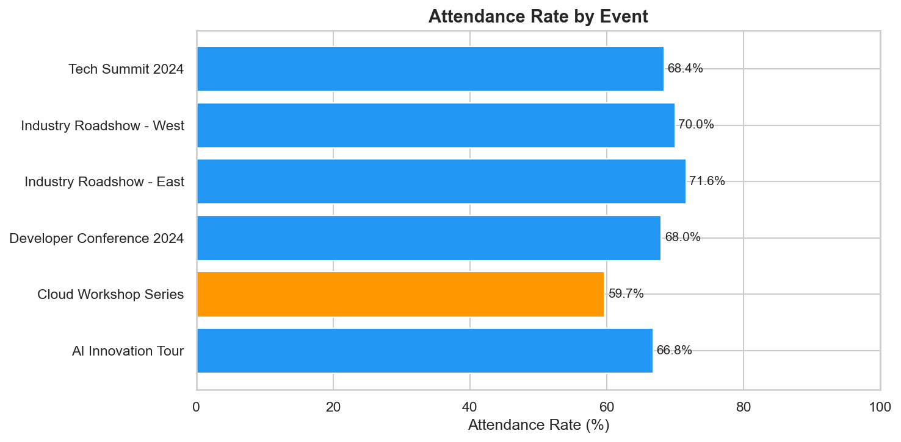
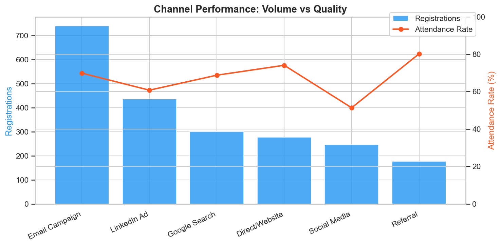
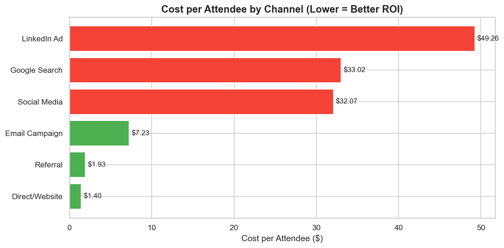
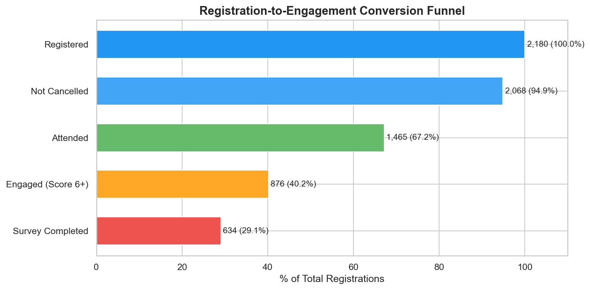
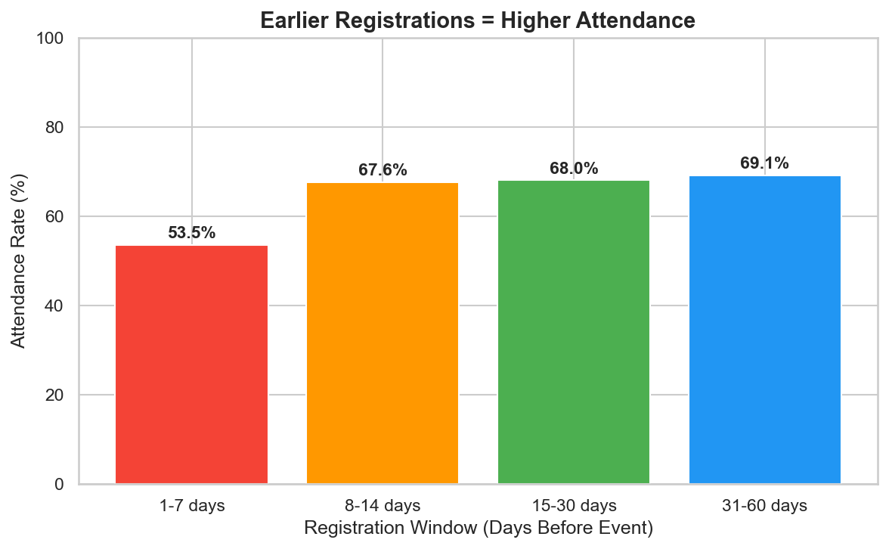
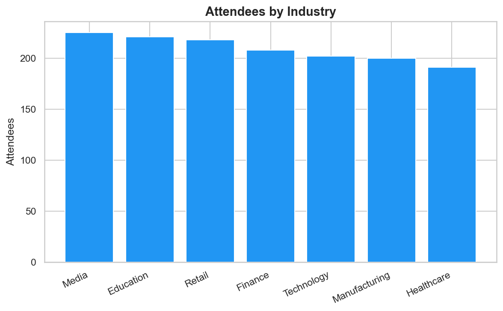

# Event Registration & Attendance Analytics

End-to-end analytics project analyzing 2,180 event registrations across 6 marketing events to measure event performance, channel attribution, conversion funnels, and attendee engagement patterns.

## Background

Having managed 16+ corporate events at Hilton's Conrad Washington DC and 8 annual programs at Virginia Tech (serving 500+ attendees), I built this project to demonstrate how event performance analytics can be done at scale using Python and SQL - moving from manual KPI tracking to automated, data-driven event intelligence.

## Key Findings

| Metric | Value |
|--------|-------|
| Overall Attendance Rate | 67.2% |
| No-Show Rate | 27.7% |
| Best ROI Channel | Direct/Website ($1.40/attendee) |
| Most Expensive Channel | LinkedIn Ads ($49.26/attendee) |
| Best Performing Event | Industry Roadshow - East (71.6%) |
| Survey Completion Rate | 43.3% |

### Channel Attribution
- **Referral** has the highest attendance rate (80.2%) and lowest cost ($1.93/attendee)
- **Email Campaign** drives the most volume (34% of registrations) with good attendance (69.9%)
- **LinkedIn Ads** are the most expensive channel at $49.26/attendee despite only 60.8% attendance
- **Social Media** has the lowest attendance rate (51.4%) - needs better targeting

### Registration Timing
- Registrants who sign up 31-60 days early attend at 69.1%
- Last-minute registrants (1-7 days) only attend at 53.5%
- Early-bird campaigns could significantly reduce no-show rates

## Dashboards

### Attendance Rate by Event


### Channel Performance: Volume vs Quality


### Cost per Attendee by Channel


### Conversion Funnel


### Registration Timing Impact


### Attendees by Industry


## Tools Used

- **Python** (pandas, numpy, matplotlib, seaborn) - data generation, analysis, visualization
- **SQL** - event performance queries, channel attribution, funnel analysis
- **Power BI / Tableau** - interactive dashboards (screenshots in /dashboards)

## Project Structure

```
event-registration-analytics/
├── README.md
├── data/
│   └── event_registrations.csv        # 2,180 row dataset
├── notebooks/
│   └── event_analysis.py              # Full Python analysis
├── scripts/
│   ├── generate_data.py               # Dataset generator
│   └── event_queries.sql              # SQL queries
└── dashboards/
    ├── 01_attendance_rate_by_event.png
    ├── 02_channel_performance.png
    ├── 03_cost_per_attendee.png
    ├── 04_conversion_funnel.png
    ├── 05_registration_timing.png
    └── 06_attendees_by_industry.png
```

## How to Run

```bash
# Generate the dataset
python scripts/generate_data.py

# Run the analysis
python notebooks/event_analysis.py
```

## Recommendations

1. **Shift budget to high-ROI channels** - Direct/Website and Referral have the lowest cost per attendee
2. **Optimize LinkedIn Ads targeting** - high spend but only 60.8% attendance rate
3. **Launch early-bird campaigns** - 30+ day registrants attend at 15% higher rates than last-minute signups
4. **Reduce no-shows with reminders** - automated email/SMS in the final 7 days
5. **Improve survey completion** - only 43.3% of attendees respond; incentivize with content access

## Author

**Deepanshi Behal**
- MBA, Virginia Tech | MS Data Analytics, McDaniel College (In Progress)
- [LinkedIn](https://linkedin.com/in/bdeepanshi)
